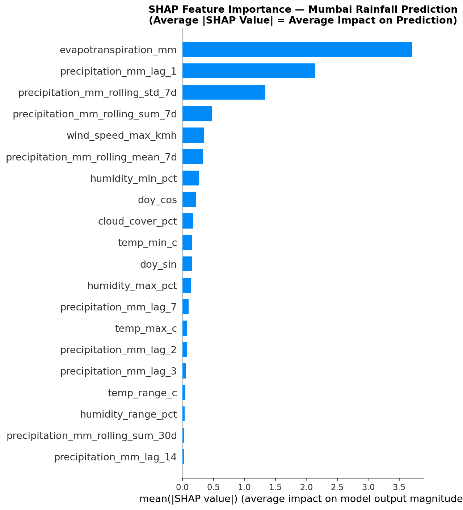
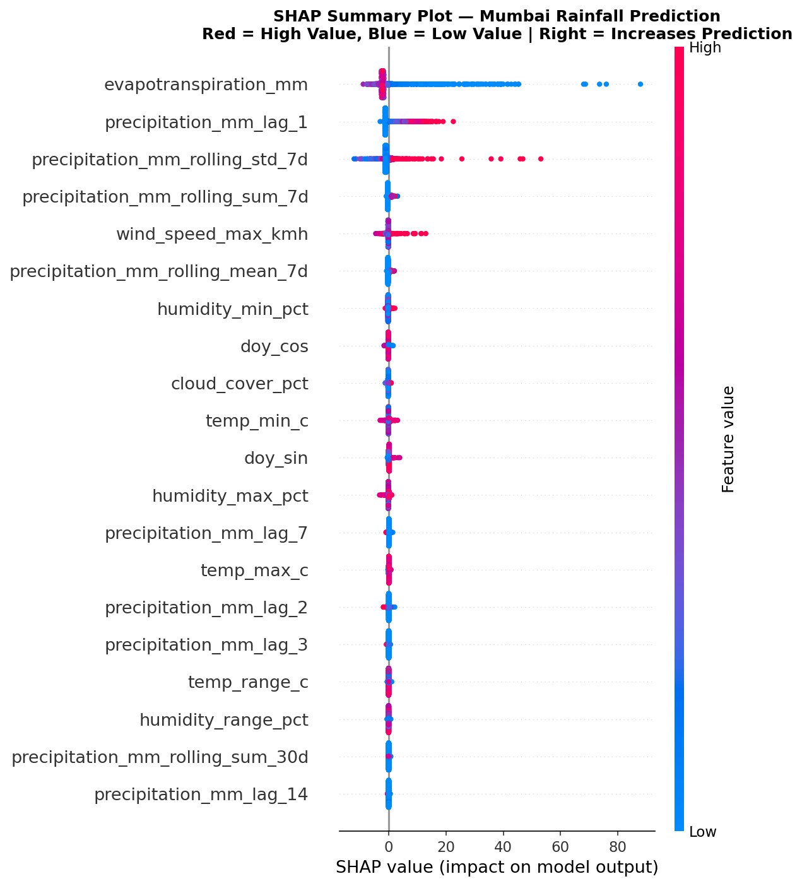

# 🌧️ Weather Intelligence and Climate Decision Support Platform

**MacroEdtech GenAI Research Internship | Phase 02 | July–August 2026**

Author: Shivya Mahajan
Mentor: Sagar Sakalley
Organization: MacroEdtech GenAI Research Internship
Project Period: July–August 2026

---

## 📋 Project Overview

This project develops an end-to-end AI-powered Weather Intelligence Platform 
for analyzing and predicting the Indian Southwest Monsoon System. 

The platform integrates:
- **Machine Learning & Deep Learning** for weather prediction
- **Computer Vision & Remote Sensing** for satellite image analysis  
- **Large Language Models (LLMs)** for intelligent weather assistance
- **RAG (Retrieval-Augmented Generation)** for knowledge retrieval
- **AI Agents** for autonomous weather analysis workflows

---

## 🏆 Best Model Performance

The rainfall prediction models were evaluated using MAE, RMSE, and R² on the test dataset.

| Model | MAE | RMSE | R² |
|------|------:|------:|------:|
| XGBoost | 2.6561 | 8.0609 | 0.7477 |

XGBoost achieved the best overall performance and was selected as the final prediction model for deployment.

---

## 🎯 Project Phases

### Part 01 (July 2026): AI-Based Weather Prediction System
Build complete ML/DL weather forecasting models for the Indian Southwest Monsoon.

### Part 02 (August 2026): GenAI Weather Intelligence Assistant  
Transform the prediction system into an intelligent AI assistant with LLMs, RAG, and AI Agents.

---

## 📁 Project Structure

```text
weather-intelligence-platform/
├── data/
│   ├── raw/
│   ├── processed/
│   └── external/
├── notebooks/
├── src/
│   ├── data_collection/
│   ├── preprocessing/
│   ├── models/
│   └── visualization/
├── reports/
│   └── figures/
├── requirements.txt
└── README.md
```

---

## 📊 Data Sources

| Source | Type | Variables |
|--------|------|-----------|
| Open-Meteo API | Historical weather | Rainfall, Temperature, Humidity, Wind, Pressure |
| ERA5 Reanalysis (Copernicus) | Climate reanalysis | All atmospheric variables |
| IMD | Indian observations | Station data |
| NASA/NOAA | Global climate | SST, Gridded data |
| Sentinel-2/Landsat/MODIS | Satellite imagery | Cloud cover, NDVI |

---

## 🏙️ Cities Covered

Mumbai, Delhi, Chennai, Kolkata, Bengaluru, Jaipur

---

## ⚙️ Setup Instructions

```bash
# Clone repository
git clone https://github.com/Shivyamahajan/weather-intelligence-platform.git
cd weather-intelligence-platform

# Create virtual environment
python -m venv venv
source venv/bin/activate  # Mac/Linux
venv\Scripts\activate     # Windows

# Install dependencies
pip install -r requirements.txt

# Collect data
python src/data_collection/collect_openmeteo.py

# Run feature engineering
python src/preprocessing/feature_engineering.py

# Open EDA notebook
jupyter notebook notebooks/01_EDA.ipynb
```

---

## 📅 Project Progress

✅ Week 1
- Data collection using Open-Meteo API
- Exploratory Data Analysis
- Feature Engineering

✅ Week 2
- Linear Regression
- Ridge Regression
- Lasso Regression
- Decision Tree
- Random Forest
- Extra Trees
- XGBoost
- LightGBM
- Model Evaluation
- SHAP Explainability

✅ Week 3
- LSTM
- BiLSTM
- GRU
- CNN
- FastAPI Backend
- Streamlit Dashboard
- Docker Integration

✅ Week 4
- Research Paper
- Documentation
- Final Deployment

## 📷 Project Outputs

### Research Framework


### SHAP Feature Importance



### SHAP Summary Plot




## 📄 Research Paper

The complete research paper is available here:

[📘 Weather Intelligence Platform Research Paper](docs/paper.pdf)
